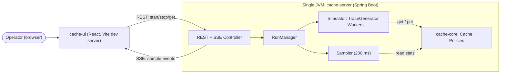
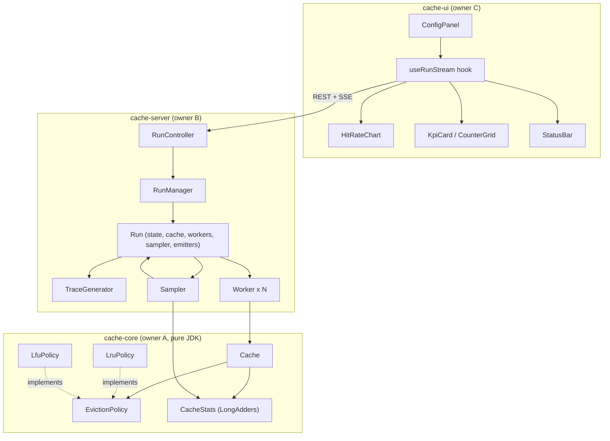
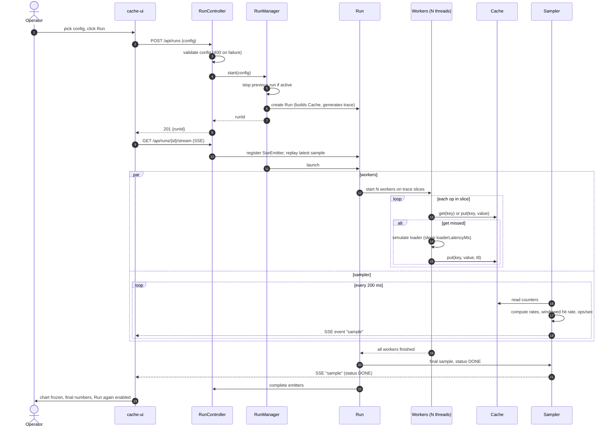
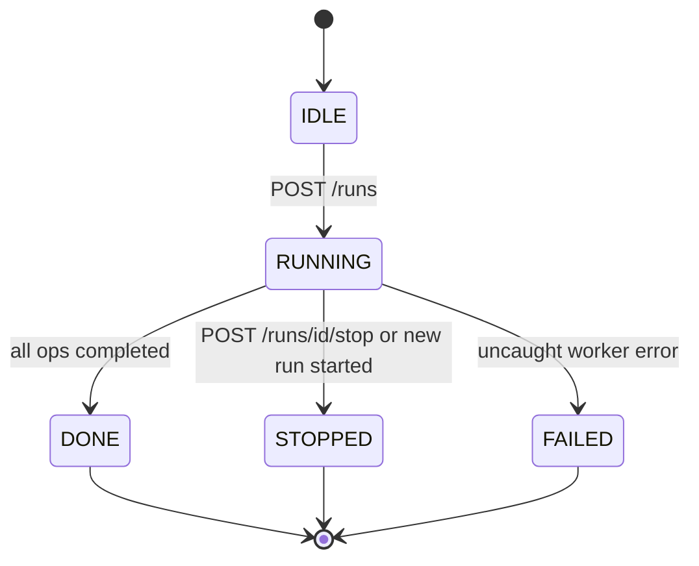
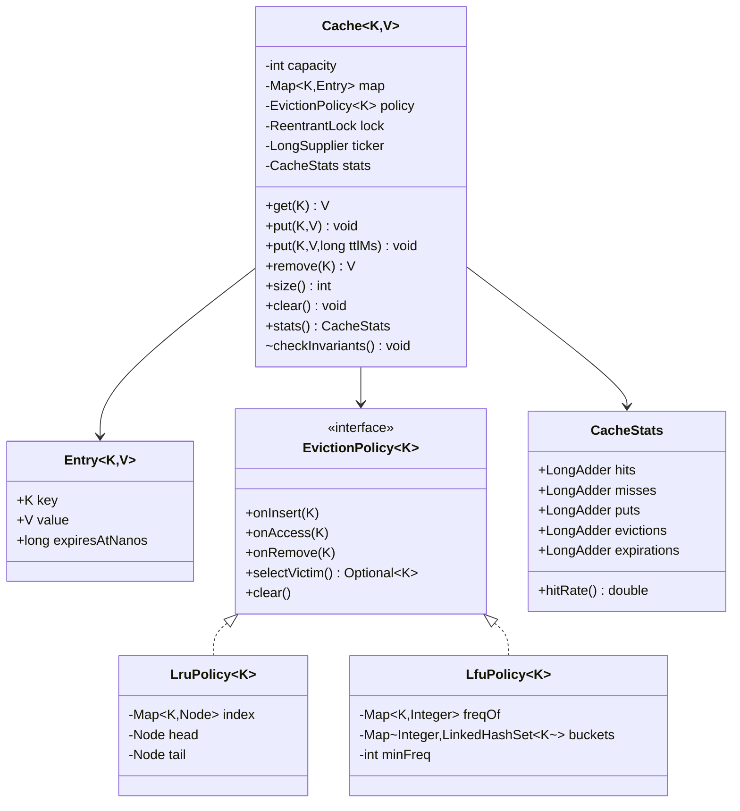
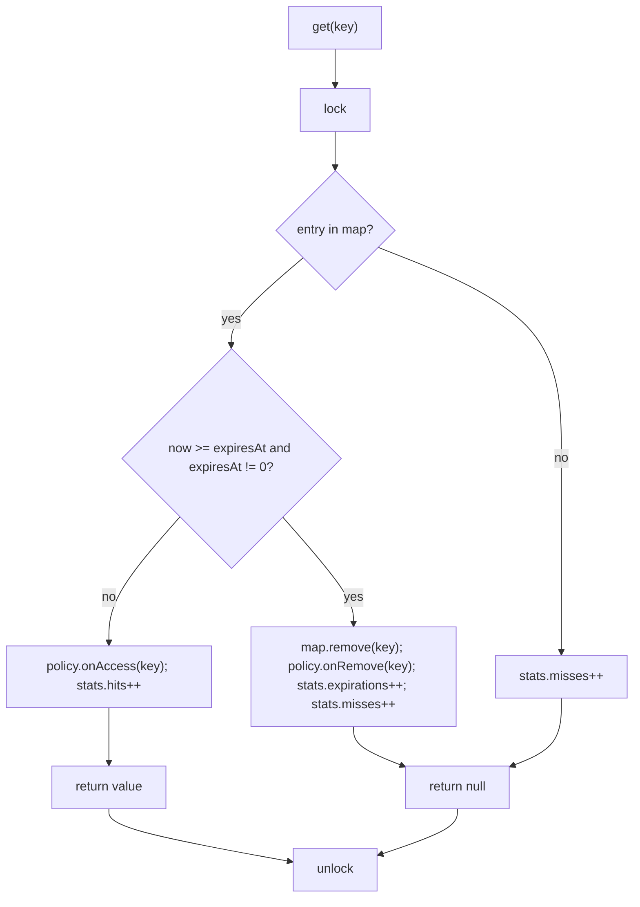
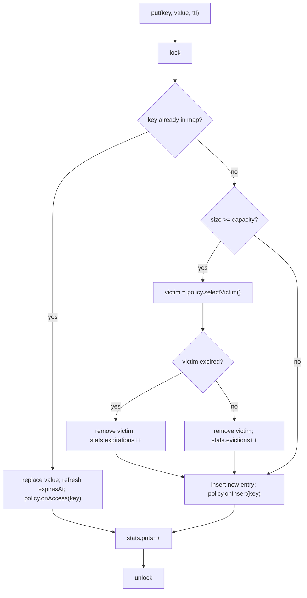
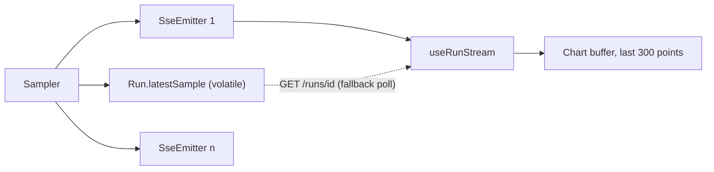

# Architecture: Cache Library + Live Metrics Panel

**Companion to:** `PRD.md`, `TECH_STACK.md` | **Style:** modular monolith, single JVM, one browser client
**Diagrams:** Mermaid (render in GitHub, VS Code, or any Markdown viewer with Mermaid support)

---

## 1. Architectural stance

**System promise:** a cache whose behavior is *provable* (correct under concurrency) and *visible* (live hit/miss/eviction/expiry metrics for any policy and traffic pattern).

| Decision | Choice | Trade-off accepted | Reversibility |
|---|---|---|---|
| Deployment shape | Modular monolith, 1 JVM | No independent scaling; no network failure modes to debug | Easy: modules already separated |
| Cache core isolation | `cache-core` is pure JDK, no framework | Slightly more glue in the server | **Hard to reverse, so decided first** |
| Policy abstraction | `EvictionPolicy<K>` strategy interface | One extra indirection | **Hard to reverse; frozen at minute 0** |
| Concurrency | One global `ReentrantLock` | Throughput ceiling; correct by construction | Medium: lock is encapsulated in `Cache`, so striping later changes one class |
| TTL ownership | `Cache` owns expiry, policies never see time | Expiry checks add a branch to every read | Medium |
| Live transport | SSE | One-way only (fine: control uses REST) | Easy |
| State | In-memory only | Runs are lost on restart | Easy |

**Boundary owners** (assign names in the README): `cache-core` (owner A), `cache-server` (owner B), `cache-ui` (owner C). Cross-boundary contracts change only by agreement of both owners.

## 2. System context



Dev topology: browser → Vite `:5173` → proxy `/api` → Spring `:8080`.

## 3. Module and component view



**Dependency rule:** `cache-ui → (HTTP) → cache-server → cache-core`. `cache-core` depends on nothing. Never the reverse.

## 4. End-to-end run flow (the main working flow)



### Run lifecycle



## 5. Cache internals (the core of the project)

### 5.1 Class model



### 5.2 GET flow (`get` is a write because it mutates policy state)



### 5.3 PUT flow



**TTL independence (FR-6):** policies only see `onInsert/onAccess/onRemove` and never a clock. Expiry decisions are made by `Cache`, and removal always goes through one private method `removeInternal(key)` that updates map + policy together, so no ghost entries can remain in either structure.

### 5.4 Policy data structures

**LRU** (all ops O(1)):
```
head <-> [MRU] <-> ... <-> [LRU] <-> tail        index: HashMap<K, Node>
onAccess/onInsert: move/add node right after head   selectVictim: node before tail
```

**LFU** (all ops O(1)):
```
freqOf:   HashMap<K, Integer>
buckets:  HashMap<Integer, LinkedHashSet<K>>     (insertion order = recency within a frequency)
minFreq:  int

onInsert(k):  freqOf[k]=1; buckets[1].add(k); minFreq=1
onAccess(k):  f=freqOf[k]; buckets[f].remove(k); if buckets[f] empty and f==minFreq: minFreq++
              freqOf[k]=f+1; buckets[f+1].add(k)
selectVictim: first element of buckets[minFreq]      (LRU tie-break within a frequency)
onRemove(k):  remove from buckets[freqOf[k]]; if that bucket is empty and it was minFreq, recompute lazily on next insert (minFreq resets to 1)
```

### 5.5 Concurrency model

| Aspect | Design |
|---|---|
| Mutual exclusion | Single `ReentrantLock` per `Cache`; every public operation takes it (including `get`) |
| Lock scope | Map + policy + TTL check only. No sleeps, loaders, JSON, or logging inside |
| Counters | `LongAdder`, read without the lock by the sampler (slightly stale is acceptable; note in README) |
| Deadlock | Impossible by design: one lock, no nested acquisition, no callbacks under the lock |
| Visibility | Fields guarded by the lock; `stats` counters are thread-safe on their own |
| Known limit | Global lock serializes ops; striped segments are the documented next step |

## 6. Server components

| Component | Responsibility | Notes |
|---|---|---|
| `RunController` | REST + SSE endpoints, DTO validation, error mapping to `400` | Thin; no logic |
| `RunManager` | Owns the active run (group, in compare mode); stops the previous one; `runId → Run` map | `AtomicReference`/`ConcurrentHashMap`; bounded history (last 5 runs) |
| `Run` | Holds `RunConfig`, `Cache`, trace, `Status`, `AtomicLong opsCompleted`, worker pool, sampler, emitters, latest sample | One per policy; compare mode creates two `Run`s that share a `compareId` |
| `TraceGenerator` | Builds `int[] trace` up front from `(pattern, keySpace, totalOps, zipfSkew, seed)` | Deterministic; same seed gives the identical trace |
| `Worker` | Processes trace slice `[from, to)`; per-op decision with `SplittableRandom(seed+idx)`: `get` with prob `readRatio`, else `put`. On `get` miss: sleep `loaderLatencyMs`, then `put` | Checks `cancelled` flag each op |
| `Sampler` | Every 200 ms builds a `Sample` from counter deltas; pushes to emitters; sends the final sample on completion | Daemon `ScheduledExecutorService` |

### Trace patterns

| Pattern | Generation |
|---|---|
| `ZIPFIAN` | Precompute CDF over `keySpace` with weight `1/rank^s`; draw uniform, binary search |
| `SEQUENTIAL_SCAN` | `key = i % keySpace` |
| `UNIFORM` | `rng.nextInt(keySpace)` |
| `HOT_SET_SHIFT` | Zipfian, but keys are remapped by an offset of `keySpace/2` after 50% of the ops |

### Sample computation

```
hitRate        = hits / max(1, hits + misses)                 (cumulative)
missRate       = 1 - hitRate
windowHitRate  = dHits / max(1, dHits + dMisses)              (since previous sample)
opsPerSec      = dOps / dSeconds
tMs            = now - runStart
```

## 7. Live delivery and resilience



| Failure | Behavior |
|---|---|
| SSE connection drops | `EventSource` auto-reconnects; the hook falls back to polling `GET /runs/{id}` every 500 ms; new subscribers get the latest sample replayed immediately |
| Emitter send fails | Remove that emitter; run continues |
| Invalid config | `400 {"error": "..."}`; UI shows the message inline; no run created |
| Worker throws | Run status becomes `FAILED`; sampler sends a final sample with the status; workers stopped |
| New Run while running | Previous run is cancelled (`STOPPED`); its stream ends with a final sample |
| Stop clicked | `cancelled=true`; `shutdownNow()` on workers; status `STOPPED` within 1 s |
| Server restart | State lost by design (in-memory); UI shows an idle state |

## 8. Compare mode (Tier 1)

`POST /api/compare` creates two `Run`s (LRU and LFU) that use **identical config and trace** (same seed) but **separate `Cache` instances**. Workers for both start together; each run has its own sampler stream. The UI subscribes to both streams, overlays the two hit-rate lines, and computes the verdict from the two final samples:

```
delta = hitRate(LFU) - hitRate(LRU)   →   "LFU +12.4 pts hit rate on ZIPFIAN"
```

Compare mode is the one exception to "single active run": it is a run *group*; a new start or compare stops the whole group.

## 9. Threading model

| Thread pool | Size | Lifecycle |
|---|---|---|
| Tomcat request threads | Default | Spring managed |
| Worker pool (per run) | `config.threads` (1..64) | Created at run start, shut down at finish/stop |
| Sampler (per run) | 1, daemon | Cancelled at finish/stop |
| TTL sweeper (Tier 2, per cache) | 1, daemon, 100 ms | Removes expired entries under the same lock via `removeInternal` |

Total threads at peak: `threads + samplers + sweepers + Tomcat`, well within a laptop's limits at the validated cap.

## 10. Quality attributes and how the architecture delivers them

| Attribute | Mechanism |
|---|---|
| Correctness | Single lock; single removal path keeps map and policy identical; `checkInvariants()` used in stress tests |
| Determinism (demo) | Seeded trace generated before the run; per-thread seeded RNG. Exact counts vary under multithreading; rates are stable |
| Observability | Every event that changes state is counted (`hits, misses, puts, evictions, expirations`) |
| Testability | Injectable ticker (no sleeps in TTL tests); core has no framework dependencies |
| Evolvability | Add policies by implementing one interface; add striping by changing only `Cache` internals |
| Safety | Hard caps on `threads`, `totalOps`, `capacity`, `keySpace` in validation |

## 11. Deliberately not built (state as roadmap in the pitch)

Striped/segmented locking, Caffeine-style buffered reads, W-TinyLFU admission, read-through loader with single-flight, distributed cache, persistence, metrics export (Prometheus), authentication.

## 12. Architecture review checklist (for the demo Q&A)

| Question | Answer |
|---|---|
| Why is `get` under the lock? | It mutates policy state (recency/frequency), so it's a write |
| How do you avoid deadlock? | One lock, no nesting, no callbacks under it |
| How does TTL interact with eviction? | Independent: `Cache` checks time; policies never see it; both structures are updated by one removal path |
| What happens to LFU counts on re-put? | Frequency is kept, TTL is refreshed |
| What is approximate? | Sampler reads counters without the lock, so a sample can be off by a few operations |
| What would you change to scale? | Stripe into N segments with their own lock and policy; eviction becomes per-segment approximate |
| What was hard to reverse? | The `EvictionPolicy` interface and the framework-free core, so they were frozen first |
