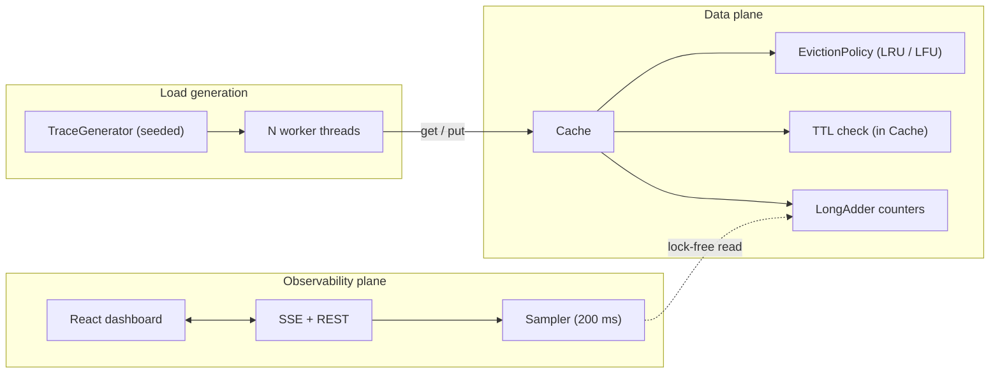
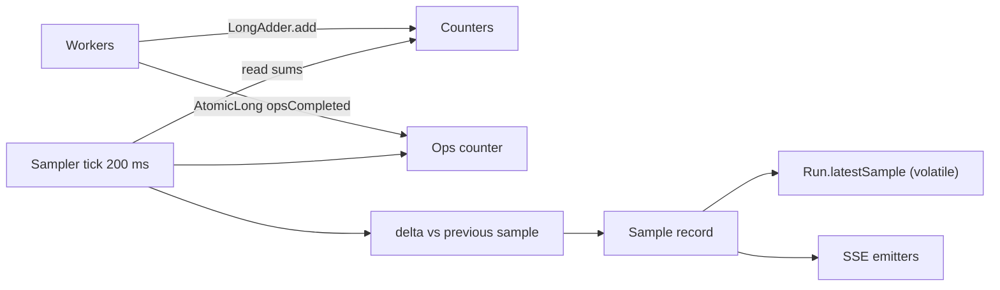
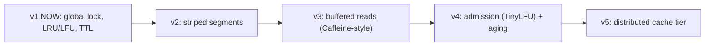
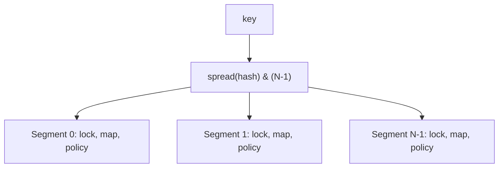

# System Design: Cache Library + Live Metrics Panel

**Companion to:** `PRD.md`, `TECH_STACK.md`, `ARCHITECTURE.md`, `UX_FLOW.md`
**Scope of this doc:** why the system is shaped this way, how it behaves under load, where it breaks, and how it evolves. Component diagrams live in `ARCHITECTURE.md`; this doc does not repeat them.

---

## 1. Problem framing

Build an in-process cache library (LRU, LFU, per-entry TTL, thread-safe) and a live observability layer that makes eviction-policy behavior measurable under controlled multithreaded traffic.

**Two systems, one product:**
1. **Data plane:** `cache-core`, the library. Latency- and correctness-critical.
2. **Observability plane:** simulator, sampler, SSE, dashboard. Throughput- and freshness-critical, but must never perturb the data plane's correctness.

**Design tension:** the observability plane measures the data plane, so it must be cheap and non-blocking on the hot path (counters via `LongAdder`, sampling off-thread, no locks taken by the sampler).

## 2. Requirements

### Functional (see PRD for IDs)
LRU + LFU, selectable policy, per-entry TTL independent of eviction, thread-safe GET/PUT, seeded workload simulator, live hit/miss/eviction/expiration metrics, compare mode.

### Non-functional targets

| Attribute | Target | Rationale |
|---|---|---|
| Correctness | Invariants hold under 16 threads × 1M ops: `size ≤ capacity`, `hits + misses = gets`, map keys = policy keys | Core credibility claim |
| Policy op cost | O(1) for get/put/evict in both policies | No scans anywhere on the hot path |
| Freshness | Metric sample delivered within ~250 ms of the counters changing | 200 ms sampling + network |
| UI smoothness | ~5 Hz updates, ≤ 300 chart points | Readable without jank |
| Startup | Two commands, no external services | Hackathon logistics |
| Stop latency | ≤ 1 s | Operator control |
| Resource safety | Bad config cannot exhaust the JVM | Live demo safety |

### Explicit non-requirements
Durability, multi-tenancy, distribution, auth, sub-microsecond latency, exact global recency under contention (see Section 8).

## 3. Assumptions and back-of-envelope estimates

All figures are estimates for planning, not measurements. Verify during integration.

### 3.1 Memory

| Item | Estimate |
|---|---|
| `HashMap` node + `Entry` (key, value, expiry) | ~80-100 B per entry (boxed `Integer` key, small value) |
| LRU node + index entry | ~+70 B per entry |
| LFU freq map + bucket set entry (`LinkedHashSet` node) | ~+110 B per entry |
| **Total per entry** | **~150-250 B** |
| Capacity cap recommended in validation | ≤ 1,000,000 entries → ≤ ~250 MB worst case; default 100 entries is negligible |
| Trace (`int[]`) | 4 B × `totalOps`; 5M ops cap = 20 MB per run (compare mode: build once, share read-only across both runs) |
| Chart buffer (browser) | 300 samples × ~200 B ≈ 60 KB |

### 3.2 Throughput: where the demo actually spends time

The miss path sleeps `loaderLatencyMs` **outside** the cache lock. This makes the demo loader-bound, not lock-bound:

```
per-op time ≈ p_hit × t_cache + p_miss × (loaderLatency + 2 × t_cache)
example: 8 threads, miss rate 12%, loader 1 ms
  ≈ 0.12 × 1 ms ≈ 0.12 ms per op per thread
  ≈ 8 threads / 0.12 ms ≈ 65k ops/s (order of magnitude; matches the ~41k ops/s sample in the PRD)
```

**Implications**
1. Lock contention is *invisible* at `loaderLatencyMs ≥ 1`. To show or test contention, set `loaderLatencyMs = 0` (raw cache throughput, where the global lock becomes the ceiling).
2. Lower miss rate means *higher* ops/s. Hit rate and throughput are visibly correlated in the demo, which is a good talking point.
3. Run duration ≈ `totalOps / opsPerSec`. At the default 200k ops and ~40k ops/s, a run lasts ~5 s and yields only ~25 samples. **Tune defaults during integration** (for example 1M ops, or `loaderLatencyMs = 2`) so the chart shows a curve, not a stub.

### 3.3 Lock cost (data plane)

Uncontended `ReentrantLock` acquire/release plus map+policy work is on the order of ~100-300 ns per op. Under contention with many threads and zero loader latency, handoff (park/unpark) dominates and total throughput flattens near single-thread speed. This is the motivation for the striping path in Section 8.

### 3.4 Observability plane

| Item | Estimate |
|---|---|
| Sample rate | 5/s per run |
| Sample size | ~250 B JSON |
| SSE bandwidth | ~1.3 KB/s per subscriber (negligible) |
| Subscribers | 1-3 (operator + maybe second tab) |
| Sampler CPU | Reading ~5 `LongAdder`s and a few subtractions: microseconds per tick |

## 4. High-level design



**Key property:** the only path from the observability plane into the data plane is a lock-free counter read. Nothing in the UI, SSE, or sampler can block or slow a cache operation.

## 5. Key design decisions (ADR summary)

| # | Decision | Alternatives considered | Why this | Cost accepted | Revisit when |
|---|---|---|---|---|---|
| D1 | Framework-free `cache-core` | Put cache inside Spring bean | Keeps the library reusable, testable without a container, and the boundary stays cheap to cut into a service later | Extra adapter code | Never; this is the load-bearing boundary |
| D2 | `EvictionPolicy<K>` strategy interface | `if (policy == LRU)` branches; subclassing `Cache` | New policies are additive; runtime selection is trivial | One indirection per op | Never |
| D3 | Single global `ReentrantLock` | `synchronized`; `ReadWriteLock`; `ConcurrentHashMap` + separate policy lock; striped segments | Correctness by construction. `get` mutates policy state, so read locks give no benefit; CHM + separate policy lock can leave map and policy inconsistent | Throughput ceiling | Benchmarks show contention (v2) |
| D4 | Expiry owned by `Cache`, not policies | Policies track time | Guarantees TTL is independent of eviction (FR-6); policies stay pure | Time check on every read | Never |
| D5 | Lazy TTL (mandatory) + sweeper (optional) | Sweeper only; timing wheel; `DelayQueue` | Lazy is exact with zero threads; sweeper only reclaims memory, so it can be cut | Untouched expired entries linger until read/evicted/swept | Memory pressure matters |
| D6 | Expired victim counts as expiration, not eviction | Count all removals as evictions | Keeps the "evictions" counter honest about capacity pressure | One branch in put | Never |
| D7 | Counters via `LongAdder`, sampler reads lock-free | `AtomicLong`; read under the lock | No contention hot spot; sampler can never block workers | Sample can be off by a few ops | Need exact snapshots |
| D8 | SSE for live push | WebSocket; polling | One-way stream is sufficient; auto-reconnect; simplest server code | Cannot send control messages (REST does that) | Bidirectional needs appear |
| D9 | Trace generated up front, seeded | Generate inline per op | Reproducible; identical trace for compare mode; generation cost excluded from the measured run | Memory `4 B × ops` | Traces exceed memory (stream them) |
| D10 | In-memory run state only | DB / file persistence | No infra; runs are ephemeral by nature | State lost on restart | Run history is a feature |

## 6. Deep dives

### 6.1 Consistency and concurrency semantics

- **Per-operation atomicity:** every public op holds the global lock for its whole duration, so operations are **linearizable** with respect to one another. Any interleaving equals some sequential order.
- **`getOrLoad` is not atomic by design:** the simulator does `get` → (miss) → sleep → `put` in separate calls. Two workers can miss the same key and both load it (a benign duplicate load; last `put` wins). This is realistic **cache stampede** behavior and is deliberately left visible. Single-flight (`computeIfAbsent`-style) is a roadmap item.
- **Metrics consistency:** counters are individually atomic but read non-atomically as a group. A sample may show `hits` from tick *t* and `misses` from *t+ε*. Error is bounded by the ops that occur during the read (microseconds). Documented, acceptable.
- **Memory visibility:** all cache state is written and read under the same lock (happens-before via lock release/acquire). `LongAdder` provides its own visibility. `Run.status` and `Run.latestSample` are `volatile`.

### 6.2 Eviction and TTL interplay

Three actors can remove entries: capacity pressure (policy), time (TTL), explicit `remove`. All go through **one private method** `removeInternal(key)`:

```
removeInternal(key): map.remove(key); policy.onRemove(key)   // always both, under the lock
```

This single choke point is what makes map and policy key sets identical (NFR-2) and prevents ghost entries.

**Edge-case table**

| Case | Behavior |
|---|---|
| Read of expired entry | Removed, counts `expirations++` and `misses++` |
| Victim chosen by policy is already expired | Removed, counts `expirations++` (not `evictions`) |
| Re-put existing key | Value replaced, TTL refreshed, LFU frequency kept, LRU treats as access, never evicts |
| High-frequency LFU entry with expired TTL | Still expires (TTL independent of policy) |
| `ttlMs = 0` | Never expires |
| Capacity 1 | Every distinct insert evicts the previous entry |
| LFU `onRemove` empties the `minFreq` bucket | `minFreq` self-heals on the next insert (set to 1) |

### 6.3 LFU characteristics (explains what the demo shows)

- **Frequency accumulates forever (no aging).** After a hot-set shift, formerly hot keys keep high counts and resist eviction, so LFU adapts slowly. This is *the* reason `HOT_SET_SHIFT` exists: LFU can lose to LRU there.
- **Scan behavior:** a sequential scan larger than capacity gives every key frequency 1 and LRU order within it; LFU degrades but protects previously hot keys, while LRU is fully flushed (hit rate → ~0 for LRU).
- **Zipfian:** a stable skewed distribution is LFU's best case.
- Known production remedies (roadmap, Section 8): frequency aging/decay, TinyLFU admission, ARC/LIRS-style adaptivity.

### 6.4 Workload model

| Pattern | Behavior demonstrated | Expected result (capacity ≪ keySpace) |
|---|---|---|
| `ZIPFIAN` | Skewed, stable popularity | LFU ≥ LRU; both well above uniform |
| `SEQUENTIAL_SCAN` | Cache pollution | LRU ≈ 0%; LFU near 0% as well but better at protecting earlier hot keys |
| `UNIFORM` | No locality (control) | Both ≈ capacity / keySpace |
| `HOT_SET_SHIFT` | Non-stationary popularity | LRU recovers fast; LFU slow |

Thread partitioning: trace is split into N contiguous slices. This preserves locality patterns within a slice; each thread seeds its own `SplittableRandom(seed + idx)` for the get-vs-put decision. Exact hit counts vary between runs (thread interleaving); rates are statistically stable.

### 6.5 Metrics pipeline



- **Cumulative rate** answers "how good is this policy overall"; **windowed rate** (delta counters) shows *behavioral change over time* (the shift, the scan collapse). The chart plots the windowed rate; KPI cards show cumulative.
- Late subscribers get `latestSample` replayed on connect; polling fallback reads the same object.

### 6.6 Run lifecycle and cancellation

- Cooperative cancellation: workers check a `volatile boolean cancelled` per operation; `shutdownNow()` interrupts the loader sleep. Worst-case stop latency ≈ one loader sleep + one sampler tick (< 1 s within validated limits).
- **Ordering guarantee:** the final sample is emitted only after all workers have terminated (`awaitTermination`), so final counters are complete and `DONE` is never emitted early.
- One active run (group) at a time; starting a new run cancels the previous, which bounds thread and memory use.

## 7. Bottleneck and failure analysis

### 7.1 Bottlenecks

| Where | When it bites | Mitigation now | Future fix |
|---|---|---|---|
| Global cache lock | `loaderLatencyMs = 0`, many threads | State the limit; demo with loader latency | Striped segments (Section 8) |
| Loader sleep | Default demo settings | Intentional: models backend latency; makes throughput depend on hit rate | n/a |
| Zipfian CDF build | Huge `keySpace` | Cap `keySpace` (e.g., ≤ 1M) | Alias method for O(1) sampling |
| SSE fan-out | Many tabs | Not a scenario at this scale | Shared broadcaster |
| JIT warm-up | First run after startup is slower | One warm-up run before the demo | n/a |
| GC pauses | Very large capacity + many threads | Cap capacity/threads | Off-heap or pooled entries |

### 7.2 Failure modes and containment

| Failure | Detection | Containment |
|---|---|---|
| Worker exception | Caught in worker wrapper | Run → `FAILED`; other workers cancelled; error surfaced in banner |
| Runaway config | Validation (`threads ≤ 64`, `totalOps ≤ 5M`, `capacity ≤ 1M`, `keySpace ≤ 1M`) | `400`, no run created |
| Deadlock | Structurally impossible (single lock, no nesting, no callbacks under lock) | Lock-free reads elsewhere; stress test with timeout as a tripwire |
| Emitter failure | `IOException`/timeout on send | Remove that emitter only |
| Lost SSE | Browser `EventSource` error | Polling fallback; latest sample replay |
| Stuck run | Stop endpoint + `shutdownNow` | Idempotent stop; new run auto-cancels old |
| OOM | Caps above | Fail fast on validation instead of at runtime |

## 8. Evolution path (what changes, and what doesn't)



### v2: Striped segments



- Each segment owns `capacity / N` entries, its own lock, map, and policy instance. Only `Cache`'s internals change; the `EvictionPolicy` interface, API, and dashboard are untouched (this is why D1-D3 were decided first).
- **Trade-off:** eviction becomes **per-segment approximate**. A hot segment can evict while a cold segment has room. With hash-uniform keys the imbalance is small; with heavy hot-key skew it is visible. Global `size()` = sum of segment sizes (approximate under concurrency).
- **Expected win:** near-linear throughput scaling with threads up to `N` when loader latency is 0.
- Runtime policy switch would take all segment locks in index order (deadlock-free).

### v3: Buffered reads (Caffeine-style)
Reads record accesses into a lossy per-thread ring buffer and return immediately; a maintenance task drains the buffers and applies policy updates under a lock. Reads become nearly lock-free; policy ordering becomes eventually consistent (acceptable for a cache).

### v4: Admission and aging
TinyLFU (count-min sketch) decides whether a new entry deserves to replace the victim; periodic halving of counters fixes LFU's stale-frequency problem. Result: strong on both scans and skew.

### v5: Distributed tier
Consistent hashing across nodes; replicate hot keys; add single-flight loading and request coalescing to prevent stampedes; TTL jitter to avoid synchronized expiry storms. New concerns: network partitions, invalidation, consistency vs availability. **Out of scope by design.**

## 9. Security and abuse resistance

Not exposed to the internet in scope, but the same discipline applies:
- Strict request validation with hard upper bounds (Section 7.2) so no request can exhaust CPU, threads, or memory.
- Dev-only CORS/proxy; no credentials; no user-provided code executed.
- Only one run group active, bounding concurrency regardless of client behavior.

## 10. Observability and verification

| Layer | Method |
|---|---|
| Correctness | Unit tests for LRU/LFU/TTL semantics; 16-thread stress with invariant check via `checkInvariants()` |
| Determinism | Seeded trace; assert the **same** trace hash across runs and compare mode |
| Behavior | Automated check that scan collapses LRU and Zipfian favors LFU for a fixed seed (AC-6) |
| Performance sanity | Run with `loaderLatencyMs = 0` and log ops/s at 1/4/8/16 threads to *show* the global-lock ceiling (a one-slide honest chart, even without JMH) |
| Runtime | Server log per run: config, duration, final counters, invariant check result |

## 11. Risks and open questions

| Risk / question | Impact | Decision |
|---|---|---|
| Default run too short for a good chart | Weak demo visual | Tune defaults during integration (Section 3.2) |
| Chart shows a flat line for Uniform | Looks broken | Explain in helper text: Uniform is the control case |
| Compare mode doubles thread load | Slower on weak laptops | Halve per-run threads in compare mode or cap total at 64 |
| Per-thread trace slices skew locality | Slightly different curves vs a single interleaved stream | Documented; acceptable |
| LFU with `capacity=1` edge cases | Bugs in `minFreq` | Covered by explicit unit test |

**Open (decide at minute 0):** whether compare mode splits `threads` between the two runs or gives each the full count. Recommendation: each run gets the full configured `threads`, with total capped at 64 in validation.

## 12. Judge Q&A (system-design angle)

| Question | Answer |
|---|---|
| Why not `ConcurrentHashMap`? | It makes the map atomic but not the map + policy pair; recency/frequency updates need to be atomic with the lookup |
| Why is your demo not lock-bound? | The loader sleeps outside the lock; set loader latency to 0 to expose the ceiling |
| What's your scaling story? | Stripe first (localized change), then buffered reads, then admission policy; distribution is a different problem |
| What is approximate in your design? | Sample grouping, striped-eviction (future), and the unsynchronized get-then-load (stampede is visible on purpose) |
| What would production need? | Single-flight loading, TTL jitter, size-aware eviction, metrics export, and benchmarks against Caffeine |
| What did you choose not to build and why? | Distribution, persistence, and auth: none affect the core claim (provable, visible eviction behavior) |
