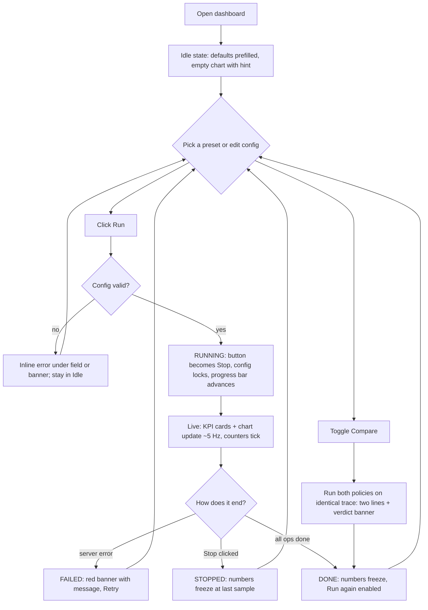

# UX Flow + Visual Language: Cache Metrics Dashboard

**Companion to:** `PRD.md`, `TECH_STACK.md`, `ARCHITECTURE.md`
**Style:** modern minimal. Neutral canvas, one accent, color used only for meaning. Fewer borders, generous whitespace, numbers as the hero.
**Stack constraints:** React + TS, Tailwind 3.4, Recharts, lucide-react, Inter (`@fontsource/inter`). Single page, no routing.

---

## 1. Design principles

1. **Numbers first.** Hit rate and miss rate are the largest elements on screen.
2. **One accent.** Indigo marks actions and selection only. Semantic colors (hit/miss/evict/expire) appear only on data.
3. **One primary action.** A single Run button; it becomes Stop while running.
4. **Calm motion.** No chart animation, 150 ms UI transitions only. The data should move, not the chrome.
5. **State is always visible.** The operator always knows if a run is idle, running, done, stopped, or failed.
6. **Not color alone.** Every colored series also has a label, and miss lines are dashed.

## 2. Primary user flow



## 3. Screen layout

### Desktop (>= 1024 px): two-column

```
┌──────────────────────────────────────────────────────────────────────────┐
│  ◧ CacheLab                              [● Running]           [☾ theme]  │  Header (56px)
├───────────────────┬──────────────────────────────────────────────────────┤
│  CONFIG           │  Presets:  [Zipfian · LFU] [Scan kills LRU] [TTL churn]│
│                   │                                                       │
│  Policy           │  ┌────────────┐ ┌────────────┐ ┌────────────┐         │
│  (LRU | LFU)      │  │ Hit rate   │ │ Miss rate  │ │ Ops / sec  │         │
│                   │  │  87.4%     │ │  12.6%     │ │  41,203    │         │
│  Pattern  ▾       │  └────────────┘ └────────────┘ └────────────┘         │
│  Capacity  100    │                                                       │
│  Key space 1000   │  ┌────────────────────────────────────────────────┐   │
│  Total ops 200k   │  │  Hit rate over time                       ● Hit │   │
│  Threads   8      │  │  100% ┤                ___________        ┄ Miss│   │
│  Read ratio 0.9   │  │       │        _______/                        │   │
│  TTL (ms)   0     │  │   50% ┤   ____/                                │   │
│  Loader ms  1     │  │       │__/                                     │   │
│  Seed       42    │  │    0% ┼────────────────────────────── time     │   │
│                   │  └────────────────────────────────────────────────┘   │
│  [ ▶ Run ]        │                                                       │
│  [ ] Compare      │  Evictions   TTL expirations   Hits     Misses  Size  │
│                   │   3,102          0             31,000   4,200  100/100│
│                   │  ━━━━━━━━━━━━━━━━━━━░░░░░  48,000 / 200,000 ops       │
└───────────────────┴──────────────────────────────────────────────────────┘
```

- Config panel: fixed 320 px, sticky, surface card. Results: fluid, max-width 960 px, centered in its column.
- Vertical rhythm: 24 px between blocks, 16 px inside cards, 4 px grid.

### Tablet/mobile (< 1024 px)
Single column: header → config (collapsible, open when Idle) → presets → KPIs (2-up grid) → chart → counters. Run button is sticky at the bottom.

## 4. Components and behavior

| Component | Content | Behavior |
|---|---|---|
| **Header** | Logo mark + "CacheLab", status pill, theme toggle | Status pill uses the state colors in Section 6 |
| **ConfigPanel** | Fields in PRD FR-12 | Segmented control for policy; `zipfSkew` field shows only when pattern is Zipfian or Hot-set shift; all inputs lock while RUNNING; each field has helper text (muted, 12 px) |
| **Presets row** | 3 chips | Click fills the config (does not auto-run). See Section 5 |
| **Run button** | Primary (accent fill) | Idle/Done/Stopped: "Run" with Play icon. Running: turns into "Stop" (neutral outline with Square icon). Disabled while a request is in flight |
| **Compare toggle** | Switch under Run | On: policy control is disabled (both policies run); results show two lines and a verdict |
| **KpiCard (x3)** | Label, big value, small delta caption | Hit rate and Miss rate cumulative; caption shows the windowed value, e.g. "last 200 ms: 90.1%" |
| **HitRateChart** | Recharts `LineChart` | Y fixed 0-100% with 25% gridlines; X is elapsed seconds; hit = solid, miss = dashed; last point has a dot; tooltip shows time, hit %, miss %; no animation; keeps 300 points |
| **CounterGrid** | Evictions, TTL expirations, hits, misses, size/capacity | Small cards; each gets a colored 6 px dot (evict = amber, expire = violet) |
| **ProgressBar** | `opsCompleted / totalOps` | 4 px tall, accent fill; shows "48,000 / 200,000 ops" |
| **VerdictBanner** (compare) | "LFU +12.4 pts hit rate on Zipfian" | Appears when both runs finish; winner's name in its series color; tie shows "No meaningful difference" when |delta| < 0.5 pts |
| **ErrorBanner** | Message from `{"error": ...}` | Sits above KPIs; rose-tinted surface; dismissible; field-level errors also highlight the input border |

## 5. Presets (demo accelerators)

| Chip | Config applied |
|---|---|
| **Zipfian · LFU** | policy LFU, pattern ZIPFIAN, capacity 100, keySpace 1000, ttl 0 |
| **Scan kills LRU** | policy LRU, pattern SEQUENTIAL_SCAN, capacity 100, keySpace 1000, ttl 0 |
| **TTL churn** | policy LRU, pattern ZIPFIAN, ttlMs 500 (expirations visibly climb) |

Optional 4th chip: **Compare Zipfian** (Compare on, pattern ZIPFIAN).

## 6. State matrix

| State | Status pill | Run button | Config | Chart / KPIs | Extra |
|---|---|---|---|---|---|
| **IDLE** | Gray "Idle" | Run | Editable | Empty chart with hint: "Pick a config and press Run" | Numbers show "-" |
| **RUNNING** | Indigo "Running" with pulsing dot | Stop | Locked (reduced opacity) | Live updating | Progress bar active |
| **DONE** | Green "Done" | Run | Editable | Frozen final values | Summary line: "Finished in 4.8 s" |
| **STOPPED** | Amber "Stopped" | Run | Editable | Frozen at last sample | n/a |
| **FAILED** | Rose "Failed" | Run | Editable | Frozen | ErrorBanner with message |
| **CONNECTION LOST** | Amber "Reconnecting" | Stop | Locked | Continues via polling fallback | Small inline notice; clears on recovery |

## 7. Interaction and motion details

- **Transitions:** 150 ms ease-out on color, border, and opacity. No layout-shifting animations.
- **Numbers:** update in place with tabular numerals (`font-variant-numeric: tabular-nums`) so digits don't jitter.
- **Run click:** button shows a 100 ms pressed state, then swaps to Stop as soon as `201` returns; the chart clears from the previous run at that moment.
- **Stop:** immediate optimistic label "Stopping..." until the final sample arrives (max 1 s).
- **Validation:** validate on blur and on Run. Show helper-colored text under the field, e.g. "Threads must be between 1 and 64". Server `400` message is shown in the ErrorBanner.
- **Keyboard:** Tab order follows the visual order; `Enter` in any field triggers Run when Idle; `Esc` triggers Stop when Running; visible 2 px accent focus ring.
- **Reduced motion:** honor `prefers-reduced-motion` (disable the pulsing dot and transitions).

## 8. Microcopy

| Where | Text |
|---|---|
| Empty chart | "Pick a config and press Run to see live hit rate." |
| Hit rate label | "Hit rate" · helper "Share of reads served from cache" |
| Miss rate label | "Miss rate" · helper "Includes reads of expired entries" |
| Evictions | "Evictions" · helper "Removed because the cache was full" |
| TTL expirations | "TTL expirations" · helper "Removed because time ran out" |
| Threads helper | "Concurrent workers hitting the cache" |
| Read ratio helper | "Share of operations that are reads; misses trigger a simulated load" |
| Done summary | "Finished in {s} s · {ops} ops · {opsPerSec} ops/s" |
| Connection notice | "Live stream interrupted. Reconnecting..." |

## 9. Color palette

Design tokens are CSS variables so light and dark themes share one Tailwind config. Values are hex.

### 9.1 Neutrals (zinc-based)

| Token | Light | Dark | Use |
|---|---|---|---|
| `--bg` | `#FAFAFA` | `#09090B` | App background |
| `--surface` | `#FFFFFF` | `#111113` | Cards, panels |
| `--surface-muted` | `#F4F4F5` | `#18181B` | Inputs, chips, table stripes |
| `--border` | `#E4E4E7` | `#27272A` | Card borders, dividers |
| `--border-strong` | `#D4D4D8` | `#3F3F46` | Input borders, hover |
| `--text` | `#18181B` | `#FAFAFA` | Primary text, big numbers |
| `--text-muted` | `#52525B` | `#A1A1AA` | Labels, helper text |
| `--text-subtle` | `#71717A` | `#71717A` | Axis ticks, placeholders (not for essential text) |

### 9.2 Accent (indigo): actions and selection only

| Token | Light | Dark | Use |
|---|---|---|---|
| `--accent` | `#4F46E5` | `#818CF8` | Run button, active segment, focus ring, progress |
| `--accent-hover` | `#4338CA` | `#A5B4FC` | Hover state |
| `--accent-soft` | `#EEF2FF` | `#1E1B4B` | Selected chip background, running pill background |
| `--on-accent` | `#FFFFFF` | `#09090B` | Text on accent fill |

### 9.3 Semantic data colors: appear only on data and status

| Meaning | Token | Light | Dark | Soft (light / dark) |
|---|---|---|---|---|
| Hit / success / Done | `--hit` | `#059669` | `#34D399` | `#ECFDF5` / `#052E22` |
| Miss / error / Failed | `--miss` | `#E11D48` | `#FB7185` | `#FFF1F2` / `#3B0A16` |
| Evictions / warning / Stopped | `--evict` | `#D97706` | `#FBBF24` | `#FFFBEB` / `#3A2705` |
| TTL expirations | `--expire` | `#7C3AED` | `#A78BFA` | `#F5F3FF` / `#1E1140` |

### 9.4 Compare mode series

| Series | Token | Light | Dark |
|---|---|---|---|
| LRU | `--series-lru` | `#4F46E5` | `#818CF8` |
| LFU | `--series-lfu` | `#0D9488` | `#2DD4BF` |

In compare mode, each policy gets a solid line for hit rate; the legend labels policy names directly ("LRU", "LFU"), not just colors.

### 9.5 Rules

1. Accent never appears on data lines; semantic colors never appear on buttons.
2. Text on `--surface` must meet 4.5:1: use `--text` or `--text-muted` only for readable text.
3. Charts: gridlines use `--border`; axis ticks use `--text-subtle`.
4. Soft tokens are for pill/banner backgrounds, paired with their solid color for the text.
5. Shadows are minimal: cards use a 1 px border and, at most, `0 1px 2px rgba(0,0,0,0.04)`; no colored glows.

### 9.6 Implementation

`src/index.css`:

```css
:root {
  --bg:#FAFAFA; --surface:#FFFFFF; --surface-muted:#F4F4F5;
  --border:#E4E4E7; --border-strong:#D4D4D8;
  --text:#18181B; --text-muted:#52525B; --text-subtle:#71717A;
  --accent:#4F46E5; --accent-hover:#4338CA; --accent-soft:#EEF2FF; --on-accent:#FFFFFF;
  --hit:#059669; --hit-soft:#ECFDF5; --miss:#E11D48; --miss-soft:#FFF1F2;
  --evict:#D97706; --evict-soft:#FFFBEB; --expire:#7C3AED; --expire-soft:#F5F3FF;
  --series-lru:#4F46E5; --series-lfu:#0D9488;
}
.dark {
  --bg:#09090B; --surface:#111113; --surface-muted:#18181B;
  --border:#27272A; --border-strong:#3F3F46;
  --text:#FAFAFA; --text-muted:#A1A1AA; --text-subtle:#71717A;
  --accent:#818CF8; --accent-hover:#A5B4FC; --accent-soft:#1E1B4B; --on-accent:#09090B;
  --hit:#34D399; --hit-soft:#052E22; --miss:#FB7185; --miss-soft:#3B0A16;
  --evict:#FBBF24; --evict-soft:#3A2705; --expire:#A78BFA; --expire-soft:#1E1140;
  --series-lru:#818CF8; --series-lfu:#2DD4BF;
}
```

`tailwind.config.js` (`darkMode: 'class'`):

```js
theme: { extend: {
  colors: {
    bg:'var(--bg)', surface:'var(--surface)', muted:'var(--surface-muted)',
    border:'var(--border)', 'border-strong':'var(--border-strong)',
    ink:'var(--text)', 'ink-muted':'var(--text-muted)', 'ink-subtle':'var(--text-subtle)',
    accent:{ DEFAULT:'var(--accent)', hover:'var(--accent-hover)', soft:'var(--accent-soft)', on:'var(--on-accent)' },
    hit:{ DEFAULT:'var(--hit)', soft:'var(--hit-soft)' },
    miss:{ DEFAULT:'var(--miss)', soft:'var(--miss-soft)' },
    evict:{ DEFAULT:'var(--evict)', soft:'var(--evict-soft)' },
    expire:{ DEFAULT:'var(--expire)', soft:'var(--expire-soft)' },
  },
  fontFamily: { sans:['Inter','system-ui','sans-serif'] },
  borderRadius: { card:'12px', field:'8px' },
}}
```

Recharts cannot read Tailwind classes, so pass `stroke="var(--hit)"` etc. directly; CSS variables work in SVG attributes.

## 10. Type, spacing, shape

| Element | Spec |
|---|---|
| Font | Inter; system fallback |
| Big KPI value | 36 px / 600, tabular numerals, `--text` |
| Card label | 12 px / 500, uppercase, letter-spacing 0.04em, `--text-muted` |
| Body / field text | 14 px / 400 |
| Helper text | 12 px / 400, `--text-muted` |
| Header title | 16 px / 600 |
| Radius | Cards 12 px, inputs/buttons 8 px, pills full |
| Spacing | 4 px grid; card padding 16-20 px; gaps 16-24 px |
| Inputs | 36 px tall, `--surface-muted` fill, 1 px `--border-strong`, focus ring 2 px `--accent` |
| Icons | lucide-react, 16 px, stroke 1.75, `--text-muted` unless active |

## 11. Accessibility checklist

- Status changes announced via `aria-live="polite"` on the status pill.
- Chart has an accessible summary: `aria-label="Hit rate over time, currently 87.4 percent"` updated every second at most.
- All controls reachable by keyboard with visible focus.
- Color is never the sole carrier of meaning (labels, dashed miss line, text in pills).
- Contrast: body text >= 4.5:1 in both themes; semantic colors on their soft backgrounds >= 4.5:1 for pill text.

## 12. UX acceptance criteria (maps to PRD)

| # | Criterion | PRD ref |
|---|---|---|
| UX-1 | Hit and miss rate are visible as large values and on the live chart during a run | AC-7 |
| UX-2 | Eviction and TTL expiration counters update live | AC-7 |
| UX-3 | Changing the policy control and pressing Run uses the new policy | AC-8 |
| UX-4 | Stop halts updates within 1 s and the UI shows Stopped | AC-9 |
| UX-5 | Invalid input shows an inline message; no run starts | AC-10 |
| UX-6 | Chart stays smooth (no visible jank) at 5 Hz for a 60 s run | NFR-4 |
| UX-7 | Both themes are readable; toggle persists for the session (in-memory state, no storage APIs) | n/a |
| UX-8 | Compare mode shows two labeled lines and a verdict banner at finish | FR-16 |

## 13. Demo walkthrough (UI script, ~2 min)

1. Click **Zipfian · LFU** → Run: hit rate climbs and settles high; point at the eviction counter.
2. Click **Scan kills LRU** → Run: hit rate collapses toward 0%.
3. Click **TTL churn** → Run: the expiration counter climbs and the hit rate drops.
4. Toggle **Compare** with Zipfian → Run: two lines diverge; read the verdict banner aloud.
